# MindScout Architecture Diagrams

Visual architecture diagrams using Mermaid (renders on GitHub, GitLab, and many markdown viewers).

## System Overview


## Paper Fetching Flow


## Semantic Search Flow

```mermaid
flowchart TD
    Start([User Query:<br/>'transformers for NLP']) --> Embed[Generate Query Embedding<br/>sentence-transformers]

    Embed --> Search[ChromaDB Vector Search<br/>Cosine Similarity]

    Search --> Top[Get Top K Results<br/>with similarity scores]

    Top --> Fetch[Fetch Full Articles<br/>from SQLite Database]

    Fetch --> Sort[Sort by Relevance<br/>relevance_score = similarity × 100]

    Sort --> Return([Return Results<br/>with scores])

    style Start fill:#e1f5ff
    style Embed fill:#fff4e1
    style Search fill:#e8f5e9
    style Top fill:#e8f5e9
    style Fetch fill:#fff4e1
    style Sort fill:#fff4e1
    style Return fill:#e1f5ff
```



## Recommendation Engine Flow


## MCP Server Integration


## Database Schema


## API Endpoints Architecture


## MCP Tools Overview


## GCP Deployment Architecture


## Deployment Flow (CI/CD)

```mermaid
sequenceDiagram
    participant Dev as Developer
    participant GH as GitHub
    participant CB as Cloud Build
    participant GCR as Container Registry
    participant CR as Cloud Run
    participant SQL as Cloud SQL

    Dev->>GH: git push origin main
    GH->>CB: Trigger webhook

    CB->>CB: Clone repository
    CB->>CB: docker build -t image

    CB->>GCR: docker push image

    CB->>CR: gcloud run deploy<br/>--image=image<br/>--set-secrets=...

    CR->>SQL: Verify connection
    SQL-->>CR: Connection OK

    CR->>CR: Run migrations<br/>Start new revision

    CR->>CR: Health check /health

    CR->>CR: Route traffic to new revision

    CR-->>CB: Deployment successful
    CB-->>GH: Update commit status ✅
    GH-->>Dev: Deployment complete!
```



## Data Flow: Complete User Journey


## Component Interaction Matrix


## Testing Coverage Overview


## Technology Stack


---

## How to View These Diagrams

1. **On GitHub**: Just open this file - Mermaid renders automatically!
2. **VS Code**: Install "Markdown Preview Mermaid Support" extension
3. **Online**: Copy to https://mermaid.live for interactive editing
4. **Export**: Use mermaid-cli to export as PNG/SVG/PDF

```bash
# Install mermaid-cli
npm install -g @mermaid-js/mermaid-cli

# Export diagram
mmdc -i ARCHITECTURE_DIAGRAM.md -o architecture.png
```

## Legend

- 🔵 Blue boxes: User interfaces / Entry points
- 🟡 Yellow boxes: Application layer / Services
- 🟢 Green boxes: Data storage / State
- 🔴 Red boxes: External services / APIs
- 🟣 Purple boxes: Monitoring / Observability
